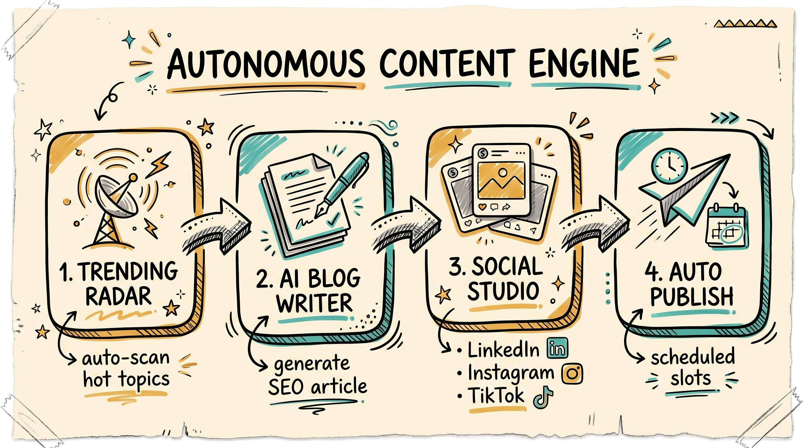

# Portfolio v2 — A Portfolio That Runs Its Own Content Factory

[](https://laravel.com)
[](https://vuejs.org)
[](https://php.net)
[](https://mysql.com)
[](https://filamentphp.com)
[](https://alisadikinma.com)

> **It looks like a portfolio. Under the hood, it's an autonomous AI content engine** that finds what's trending, writes the blog post, turns it into social-media carousels, and schedules everything across LinkedIn, Instagram, TikTok & Threads — with a human only tapping "approve."

<p align="center">
  
</p>

---

## 🤯 Why this is not a normal portfolio

Most portfolio sites are static brochures. This one **produces content while you sleep.** A single trending topic flows end-to-end without anyone writing a word:

```
📡 Trending Radar  →  ✍️ AI Blog Writer  →  🎨 Social Studio  →  📅 Auto Publish
   (Google Trends/      (research → write →    (carousel slides     (weekday slots,
    News, scored)        score → SEO → images)  for 4 platforms)     holiday-aware)
```

| The Engine Does This… | …So You Don't Have To |
|---|---|
| **Scans trends daily** from Google Trends + Google News, scores each by virality (≥70 only) | Hunt for topics |
| **Writes a full SEO article** via Claude Code CLI — research, draft, 5-gate scoring (100-pt), hero + inline images, ID→EN translation | Write, edit, source images |
| **Fans out to social** — auto-generates **sketchnote carousels** for LinkedIn + Instagram + TikTok + Threads from the same article | Design slides per platform |
| **Schedules & publishes** into fixed weekday slots (skips weekends + Indonesian public holidays) via Publer | Babysit a calendar |
| **Self-heals** — circuit breakers, stuck-job reapers, transient-retry, and Telegram alerts when a human is genuinely needed | Monitor dashboards |

The whole loop is governed by **state machines** (illegal transitions throw, every move is audit-logged) and runs on a **systemd queue worker + cron scheduler** on the VPS. Nothing silently fails — it either completes, retries, or pings you on Telegram.

---

## 📲 Drop a link in Telegram → get social posts back

Beyond the trending engine, there's a second intake path: **send any Instagram post URL (or source link) to a Telegram bot**, and the system captures it, fact-checks it, rewrites it sharper in your voice, and lands it as a ready-to-publish carousel.

<p align="center">
  
</p>

1. **Send** a link to the bot.
2. The pipeline **captures** the source (headless Playwright), **vision-extracts** the claims, and **deep-researches** each one to correct + strengthen with sources.
3. It **rewrites** a sharper, more accurate version in Ali's voice.
4. You pick **Blog** or **Carousel** with a tap → it lands in the same publishing pipeline.

Then it asks, right inside Telegram: **"When should I post this?"** — suggesting the next free weekday slot and confirming back on conflicts. Human-in-the-loop, zero dashboards.

---

## 🧠 The platform underneath

Everything above rides on a production-grade full-stack app:

- **Backend** — Laravel 12 (PHP 8.2) · MySQL 8 · Sanctum 4 (auth) · Filament 4.1 (admin) · 140+ REST endpoints
- **Frontend** — Vue 3.5 · Rolldown-Vite 7.1 · Pinia 3 · TanStack Query 5.90 · Tailwind 4 — a fast SPA with an admin **Content Engine**, **Social Studio**, **Content Calendar**, and **Scheduler** built in
- **AI layer** — Claude Code CLI + custom plugins on the VPS (article-writer, carousel-gen, linkedin/ig/tiktok/threads writers), GeminiGen for images, Firecrawl + Wikidata for facts
- **SEO/GEO** — server-side-enriched homepage + blog (JSON-LD entity graph, crawlable `<article>`, `llms.txt`) so ChatGPT, Perplexity, Claude & Google AI can cite the content
- **Edge** — Cloudflare CDN (60–80% origin bandwidth saved) + ETag/304 revalidation + WebP/LQIP image variants

| At a glance | |
|---|---|
| **Production** | https://alisadikinma.com |
| **API endpoints** | 140+ |
| **Social platforms automated** | LinkedIn · Instagram · TikTok · Threads |
| **Content pipeline** | Trending → Blog → Carousel → Publish, fully FSM-guarded |
| **Cached load time** | <500ms (83% faster repeat visits) |
| **Deploy** | `git push` → GitHub Actions → VPS (zero manual SSH) |

---

## 🚀 Quick Start (local, ~15 min)

> Backend runs on **XAMPP Apache** — do **NOT** use `php artisan serve`.

```bash
# 1. Start XAMPP (Apache :80 + MySQL :3306)

# 2. Backend
cd backend
composer install
cp .env.example .env
php artisan key:generate          # then edit .env DB credentials
php artisan migrate --seed
php artisan storage:link

# 3. Frontend
cd ../frontend
npm install
cp .env.example .env
npm run dev                       # http://localhost:5173
```

| Service | URL |
|---|---|
| Frontend (dev) | http://localhost:5173 |
| Backend API | http://localhost/Portfolio_v2/backend/public/api |
| Health check | …/api/health |
| Production | https://alisadikinma.com |

Create an admin: `php artisan tinker` → `User::create(['name'=>'Admin','email'=>'admin@test.com','password'=>bcrypt('password')]);`

---

## 🗺️ How the content engine is wired

```
Admin /content-engine  ──┐
Daily trending cron      ─┼──► ContentIdea (FSM)
Telegram IG link         ──┘        │
                                    ▼
        ArticleGenerationService ──► Claude CLI on VPS (SSH)
        prep → write → score → images → translate
                                    │
                          published Blog Post
                                    │  (event-driven)
                                    ▼
        ScanLinkedInForCrossPost ──► LinkedIn + IG + TikTok + Threads drafts
                                    │
                  /carousel-gen ──► sketchnote slides (GeminiGen)
                                    │
        social:publish-slot cron ──► Publer ──► live posts (weekday slots)
```

- **State machines** — `ContentIdeaStatus` / `LinkedInPostStatus` / `RepurposeJobStatus` via `HasStatusTransitions` + `PipelineGuard`. Every transition is validated and logged to `pipeline_state_log[]`.
- **Self-healing** — GeminiGen circuit breaker, stuck-slide reapers, transient-retry with backoff, caption-readiness gates, and Telegram alerts only when a human is truly needed.
- **DB-driven scheduler** — toggle/retime/run-now any cron from `/admin/settings?tab=scheduler` without redeploying.

---

## 🔌 API surface (140+ endpoints)

```
Public        GET  /api/posts /projects /awards /galleries /testimonials /services
              GET  /api/sitemap*.xml /api/llms.txt /api/llms-full.txt /api/health
              POST /api/contact /api/chatbot/ask /api/newsletter/subscribe
Admin         CRUD /api/admin/{posts,projects,awards,galleries,testimonials,...}
 (sanctum)         /api/admin/content-engine/*   (idea pipeline + 2-gate approval)
                   /api/admin/linkedin-drafts/*  (social drafts, carousel render, publish)
                   /api/admin/repurpose/*        (Telegram IG intake jobs)
                   /api/admin/scheduler/*        (DB-driven cron control)
Automation    CRUD /api/automation/posts        (n8n / Zapier / Make.com)
              POST /api/automation/blog/image-webhook  /api/automation/geminigen/webhook
CV Export     GET  /api/cv/export  /api/cv/master.md   (token-scoped, for jobhunter)
```

**Response envelope:** `{ "success": true, "data": {…}, "message": "…" }` / `{ "success": false, "error": { "code": "…", "message": "…" } }`

---

## 🛠️ Essential commands

```bash
# Backend
php artisan migrate --seed
php artisan route:list
php artisan test
php artisan linkedin:scan-blog --hours=720    # backfill social drafts
php artisan images:generate-variants          # WebP + LQIP backfill

# Frontend
npm run dev          # dev server :5173
npm run build        # production build
```

| Issue | Fix |
|---|---|
| "Class not found" | `composer dump-autoload` |
| HMR broken | `npm run dev -- --force` |
| CORS errors | check `backend/config/cors.php` + `php artisan config:clear` |
| Storage images 404 | `php artisan storage:link` |
| FormData PUT fails | use `POST` with `_method=PUT` |

---

## 🚢 Deployment

**Fully automated — never SSH-deploy manually.** Every `git push origin main` triggers GitHub Actions → SSH into VPS → `scripts/deploy.sh`:

```
git reset --hard → composer install → migrate --force → idempotent seeders
→ cache:recache → npm ci && npm run build → fix permissions → queue:restart → health check
```

Production runs on a VPS (Nginx + SSL + Cloudflare). The queue worker (`portfolio-queue.service`) and scheduler cron must be running for the content engine to fire — see [CLAUDE.md](./CLAUDE.md) → *VPS Background Process Setup*.

---

## 📚 Documentation

| Document | What's inside |
|---|---|
| [CLAUDE.md](./CLAUDE.md) | Architecture reference + conventions + ops gotchas (the source of truth) |
| [backend/README.md](./backend/README.md) | Backend technical details |
| [frontend/README.md](./frontend/README.md) | Frontend architecture |
| [docs/runbooks/](./docs/runbooks/) | Deploy + ops runbooks (SEO/SSR, newsletter, repurpose, cross-post) |
| [docs/plans/](./docs/plans/) | Design + implementation plans per feature |

---

## License

**© 2025–2026 Ali Sadikin.** All rights reserved. Proprietary and confidential.

📧 ali.sadikincom85@gmail.com · 📍 Batam, Indonesia · 🌐 https://alisadikinma.com

---

**Stack:** Laravel 12 · Vue 3.5 · MySQL 8 · Claude Code CLI · GeminiGen · Publer · Telegram
**Status:** Production · **Updated:** June 12, 2026
